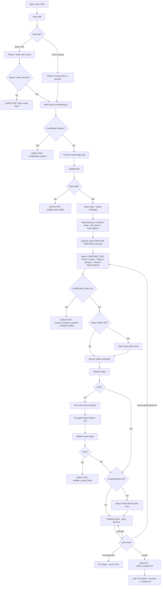

# Zoho Web Page Builder — Working Flowchart

Analytics · Writer / DOCX → compose → inject → validate → review

## Files

| File | Use |
|------|-----|
| `web-page-builder-workflow.mmd` | Raw Mermaid — import into Mermaid Live, draw.io, Notion |
| `web-page-builder-workflow.html` | Open in browser → **Print / Save as PDF** |
| `web-page-builder-workflow.md` | Paste into GitHub / Notion / Confluence (Mermaid support) |
