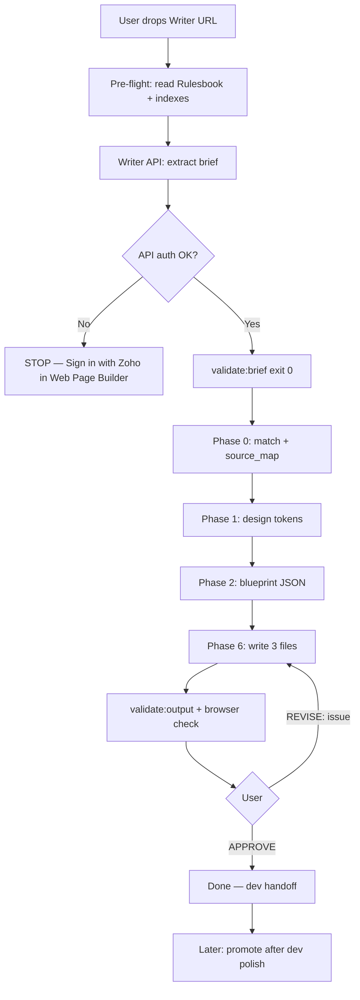

# Agent + Project Workflow

**Unified guide:** how the Cursor agent operates inside the Zoho Web Page Builder repo.

| | |
|---|---|
| **Entry trigger** | `{writer-doc-link}` + `read readme.md and start` |
| **Canonical playbook** | [`cursor-build-workflow.md`](cursor-build-workflow.md) |
| **Coding law** | [`Rulesbook.md`](Rulesbook.md) |
| **Always-on override** | [`.cursor/rules/structure-first-pipeline.mdc`](../.cursor/rules/structure-first-pipeline.mdc) |
| **Gold-standard output** | `output/sales-dashboard-examples/` |

> **Note:** [`Workflow.md`](Workflow.md) (v6.0) describes an older random webtemplate-pick flow. The **current** path is **structure-first compose** from `Reference-Site/` + live `webtemplate` sections via Chrome MCP — not whole-page clone, not random template names as sole design direction.

---

## 1. What the agent does

The agent turns a **Zoho Writer brief** into a **structured dev handoff**:

```
output/{page-slug}/
├── index.html   ← composed sections, brief copy only
├── style.css    ← page-scoped CSS, team tokens
└── script.js    ← only behaviors this page needs
```

**Deliverable intent:** semantic HTML + correct BEM patterns + placeholder assets. The dev team swaps assets, wires nav/footer templates, and polishes. The agent does **not** ship production-final pages.

**Core principle — compose, never clone:**

| Do | Do not |
|----|--------|
| Pull **one section pattern** at a time from reference or webtemplate | Copy an entire reference `index.html` and swap copy |
| Repeat blocks per **brief count** (8 zigzag rows, 5 FAQ items) | Keep reference section counts or extra sections |
| Extract **only CSS rules** for classes on this page | Copy whole reference `style.css` / `script.js` |
| Use Writer doc as **only** copy source | Invent headings, sections, or lorem ipsum |
| Leave nav/footer as **comment placeholders** | Build nav or footer code |

---

## 2. How to start a build

```
{writer-doc-link}
read readme.md and start
```

The agent then runs autonomously through Phases 0 → 1 → 2 → 6, opens the result in the browser, and waits for **APPROVE** or **REVISE**.



---

## 3. Agent operating model

### 3.1 Autonomy rules

| Rule | Behavior |
|------|----------|
| **No permission during build** | Phases 0, 1, 2, 6 run without asking — read files, match, compose, write |
| **Hard stops only** | Zoho login wall · failed extraction · confidential content in brief · `validate:brief` / `validate:output` failure |
| **Human input after build** | `APPROVE` · `REVISE: [specific issue]` · `OVERRIDE` on source_map (one cycle after Phase 0) |
| **Do not over-fetch** | Fetch webtemplate URLs only for sections mapped `source_type: webtemplate` — never loop all 630 links |
| **Session-fresh brief** | Writer extraction via **Writer API** in this build (sidecar `writer_api`) |
| **Chrome MCP** (`user-chrome-devtools`) | Live **marketing** webtemplate sections · open `file://` output for visual check — **never** Writer docs |

### 3.2 Tools the agent uses

| Tool | Role in this project |
|------|----------------------|
| **Writer API** (`web-tool/server/writer-api.js`) | Extract Writer brief (DOCX download) — **only** Writer path |
| **Chrome MCP** (`user-chrome-devtools`) | Live marketing webtemplate sections · open `file://` output — **never** Writer docs |
| **Read / Grep / Glob** | Reference sections, indexes, briefs, Rulesbook |
| **Shell** | `npm run validate:brief`, `validate:output`, `match`, `promote`, `audit` |
| **Write / StrReplace** | `output/{slug}/` files · `state.json` · `briefs/{slug}.txt` |

### 3.3 Always-applied Cursor rules

These load automatically and override improvisation:

1. **`.cursor/rules/structure-first-pipeline.mdc`** — compose from section patterns; Writer MCP gate; anti-patterns (CTA visibility, pre-banner texture, testimonial palette)
2. **`.cursor/rules/web-pages-frontend.mdc`** — HTML/CSS/JS standards, placeholders, breakpoints, validation checklist

### 3.4 Sources of truth (priority order)

```
1. Writer brief (z_workflow/briefs/{slug}.txt)     → copy, sections, block counts
2. Rulesbook.md                                    → fonts, BEM, breakpoints, CTA red
3. structure-first-pipeline.mdc                    → compose mandate
4. section-composites.json                         → multi-section archetype order
5. section-index.json                              → section type → reference + BEM class
6. Reference-Site/{page}/                          → on-disk section patterns
7. webtemplate/sitemap-categorized.json            → live section patterns (MCP fetch)
8. state.json                                      → session memory across phases
```

On conflict: **Rulesbook wins** over reference habits; **brief wins** over reference section counts.

---

## 4. Pre-flight (every build)

Before any phase work:

```
[ ] Read z_workflow/Rulesbook.md in full
[ ] Read source/zohocustom.css + source/product.css
[ ] Load cached indexes (no full folder scan):
      section-index.json
      site-catalog.json
      team-dna.json
      section-composites.json
      webtemplate/sitemap-categorized.json
[ ] Read writer-drop-playbook.md + agent-build-gates.md
[ ] Read or initialize z_workflow/state.json
```

**Hard stops:** no build without a validated brief. Nav and footer are never built.

---

## 5. Phase 0 — Acquire brief · Catalog · Match

### 5.1 Writer brief extraction (mandatory gate)

**Only allowed method:** Zoho **Writer API** (`web-tool/server/writer-api.js` / Web Page Builder Phase 0).

| Step | Action |
|------|--------|
| 1 | Build / extract via `extractWriterViaApi` (OAuth + DOCX download) |
| 2 | **Auth gate:** API 401/403 or no tokens → **STOP**, ask user to Sign in with Zoho in the tool |
| 3 | Confirm `briefs/{slug}.extract.json` → `extraction_method: "writer_api"` |
| 4 | Brief at `z_workflow/briefs/{slug}.txt` |
| 5 | `npm run validate:brief -- --file z_workflow/briefs/{slug}.txt` — **exit 0** |

**Forbidden:**

- Chrome MCP or Puppeteer for Writer documents
- Stale `briefs/*.txt` from a prior session without API re-extract
- Pasted text when a Writer URL was given
- Building on failed API extraction

**Extraction quality gates:**

- Sidecar `extraction_method` is `writer_api`
- Char count ≥ 90% of Writer footer `Chars:` when available (not sufficient alone)
- Archetype required strings per `section-composites.json`

Parse into `state.json → writer_brief`:

- `page_title`, `page_type`, `product_name`, `target_audience`, `tone`
- `keywords`, `key_messages`, `sections_required` (exclude nav/footer)
- Repeatable block counts (zigzag rows, FAQ items, cards, steps)

### 5.2 Catalog + similarity match

```bash
node z_workflow/scripts/match-sites.mjs
# or: npm run match -- --brief-file z_workflow/briefs/{slug}.txt
```

Scoring weights from `match-config.json`: topic · page type · section overlap · tone · complexity.

**Deep-read only mapped sections** — not every file in the top match.

Build `state.json → similarity`:

```json
{
  "primary_source": "Executive-Dashboards",
  "structure_mode": "compose",
  "archetype": "dashboard-examples-landing",
  "source_map": [
    {
      "brief_section": "hero",
      "source_folder": "Executive-Dashboards",
      "bem_class": "banner-section",
      "source_type": "reference",
      "layout_style": "split text left, image right"
    }
  ]
}
```

**Per-section source selection:**

| `source_type` | When | How to read |
|---------------|------|-------------|
| `reference` | Pattern exists in `Reference-Site/` | Read local `index.html` / CSS / JS for that section only |
| `webtemplate` | No strong on-disk match; category maps to sitemap | `npm run find:webtemplate -- <type> "<layout>"` → MCP fetch **one section** |

Wait one cycle for user **OVERRIDE** on source_map, then proceed.

---

## 6. Phase 1 — Design tokens

Extract from mapped reference sections + `source/` into `state.json → phase_1.design_tokens`:

- Colors as `--color-*` in `:root`
- Puvi via `var(--zf-primary-*)` — **never** numeric `font-weight`
- Spacing, radii, transitions from sections actually used
- One-sentence `team_flavour` summary

---

## 7. Phase 2 — Page blueprint (no code)

Write `state.json → phase_2.webpage_blueprint` — JSON spec per section:

| Field | Source |
|-------|--------|
| `source_site` | Real folder name (e.g. `Executive-Dashboards`) |
| `source_section_id` | BEM class (e.g. `dashboard-wrapper`) |
| `repeat_count` | From **brief**, not reference |
| `layout_style`, `bg_treatment` | From mapped pattern |
| All copy fields | From brief only — zero lorem ipsum |
| `adaptation_notes` | Same BEM pattern, brief-driven content/counts |

**Archetype section order** (when `section-composites.json` matches):

**`dashboard-examples-landing`:** hero → sticky-stack types → one-click CTA → integrations → recognition → testimonials → steps → closing CTA → FAQ

**`agency-landing`:** hero → intro → zigzag features → benefits → comparison → how-it-works → testimonials → recognition → CTA intro → demo CTA → FAQ

Full tables: [`writer-drop-playbook.md`](writer-drop-playbook.md) §2.

---

## 8. Phase 6 — Production build

**Output:** `output/{page-slug}/` — exactly three files.

### 8.1 Build order

1. **Compose `index.html`** section by section:
   - Pull HTML skeleton from mapped source (reference disk or webtemplate MCP)
   - Instantiate `repeat_count` blocks
   - Inject copy from `briefs/{slug}.txt`
   - Wrap in `.page-container` per team pattern
2. **Write `style.css`:**
   - Global typography block at top
   - `:root` from Phase 1 tokens
   - **Only** rules for classes on this page (extracted from reference, not full-file copy)
   - Mandatory CTA visibility override (see §9)
   - All 7 breakpoints at bottom: **1240 · 1080 · 991 · 767 · 565 · 480 · 350**
3. **Write `script.js`** — accordion, slick, tabs, sticky scroll, steps auto-advance — **only if present**
4. **Link** `../../source/zohocustom.css` + `../../source/product.css`
5. **Images** — `https://prezohoweb.zoho.com/` + `<!-- TODO: replace with final asset -->`
6. **Nav/footer** — comment placeholders only:

```html
<!-- ░░ NAV — TEAM TEMPLATE · INSERT HERE ░░ -->
<!-- ░░ FOOTER — TEAM TEMPLATE · INSERT HERE ░░ -->
```

### 8.2 Section gate (check each section before moving on)

- [ ] BEM classes match mapped reference pattern
- [ ] Copy only from brief
- [ ] Block count matches brief
- [ ] Mid/closing red CTAs inside `pre-banner-section` with textured background
- [ ] Zigzag rows: clip-path panels, `100px 0` padding, centered image column
- [ ] Responsive rules at all 7 breakpoints

### 8.3 Adaptation rule

| Keep from reference | Driven by brief |
|--------------------|-----------------|
| BEM class names, DOM hierarchy | Which sections exist |
| Component shape (card, zigzag, accordion) | How many repeated blocks |
| Spacing, breakpoints, animation hooks | All visible text |
| JS interaction patterns | Images, hrefs, section ids |

---

## 9. Critical build gates (agent must not skip)

### 9.1 CTA visibility + brand red

Linked `zohocustom.css` hides `.act-btn.cta-btn` until team nav loads. **Every page CSS must override:**

```css
:root {
    --color-brand-cta: #e42527;
    --primary-btn-color: #e42527;
}

.page-container .cta-btn.act-btn {
    display: inline-block;
    visibility: visible;
    opacity: 1;
    background: var(--primary-btn-color);
    color: #fff;
}
```

Brand red `#e42527` is **theme-independent** — do not tint from `--color-primary`.

Gold standard: `output/client-dashboard-software/style.css`

### 9.2 Pre-banner CTA bands

Red CTAs before FAQ/page end must sit in `#conclusion.pre-banner-section` with a catalogued end-banner treatment — **not** plain white `za-bottom-section`.

Pick from `z_workflow/end-banner-types.json` (Phase 0 writes `state.similarity.end_banner`). Do not reuse the same texture/gradient on every build.

Gold standards: `output/ppc-agency-client-dashboard`, `output/white-label-reporting`

### 9.3 Testimonial card palette

Do **not** theme-tint `.zwc-nav-box` cards. Use fixed peach/mint/blue from `Rulesbook.md` §2.2.2.

Gold standard: `output/sales-dashboard-examples/style.css`

### 9.4 Validation scripts

```bash
# Before build
npm run validate:brief -- --file z_workflow/briefs/{slug}.txt

# Before APPROVE
npm run validate:output -- --slug {slug}
# or: npm run validate:output -- --from-state
```

Both must exit **0**.

---

## 10. Review · Revise · Approve

After all three files are written:

1. Run `validate:output` — exit 0
2. Run checklist in `.cursor/rules/web-pages-frontend.mdc` + [`agent-build-gates.md`](agent-build-gates.md)
3. **Open in browser (mandatory):**

```
new_page { url: "file:///<abs-path>/output/{slug}/index.html" }
```

Then `take_snapshot` / `take_screenshot`. Confirm CTAs are **visible**, not just in DOM.

4. Print build summary (section mapping, `source_type` per section, revise round)
5. Wait for user:

| Command | Agent action |
|---------|--------------|
| **APPROVE** | Set `state.json → phase_6.approved = true` |
| **REVISE: [issue]** | Fix only named issue · rewrite affected file only · increment `phase_6.revise_rounds` |
| **PROMOTE** | After dev polish: `npm run promote -- --from-state` → `Reference-Site/agent-reference/` |

**Promote is not at APPROVE time** — devs polish nav, footer, assets first.

---

## 11. State tracking

`z_workflow/state.json` is read at phase start, written at phase end:

```json
{
  "run_id": "sales-dashboard-examples-2026-07-07",
  "page_slug": "sales-dashboard-examples",
  "writer_brief": {
    "source_url": "https://writer.zoho.com/...",
    "raw_content_file": "z_workflow/briefs/sales-dashboard-examples.txt",
    "sections_required": ["hero", "dashboard-types", "..."],
    "page_title": "..."
  },
  "similarity": {
    "primary_source": "Executive-Dashboards",
    "structure_mode": "compose",
    "archetype": "dashboard-examples-landing",
    "source_map": []
  },
  "phase_1": { "status": "complete", "design_tokens": {} },
  "phase_2": { "status": "complete", "webpage_blueprint": {} },
  "phase_6": {
    "status": "complete",
    "output_path": "output/sales-dashboard-examples/",
    "approved": false,
    "promoted": false,
    "revise_rounds": 0
  }
}
```

---

## 12. Command reference

```bash
npm run commands          # full cheat sheet

# Brief
npm run validate:brief -- --file z_workflow/briefs/{slug}.txt

# Matching
npm run match -- --brief-file z_workflow/briefs/{slug}.txt
npm run find:webtemplate -- hero "split left"

# Output
npm run validate:output -- --slug {slug}
npm run validate:output -- --from-state

# Maintenance
npm run audit             # refresh site-catalog.json
npm run audit:webtemplate # refresh sitemap audit cache
npm run promote -- --from-state
npm run promote -- --slug {slug}
npm run organize          # move stray refs → Reference-Site/
```

---

## 13. Project structure

```
Web-pages/
├── README.md                              ← user entry point
├── source/                                ← READ ONLY (zohocustom.css, product.css)
├── Reference-Site/                        ← on-disk section patterns
│   ├── {legacy pages}/
│   └── agent-reference/                   ← promoted gold standards
├── webtemplate/
│   └── sitemap-categorized.json           ← 630 live links, sections[] metadata
├── z_workflow/
│   ├── AGENT-PROJECT-WORKFLOW.md          ← this file
│   ├── cursor-build-workflow.md           ← phase playbook
│   ├── Rulesbook.md                       ← coding law
│   ├── writer-drop-playbook.md            ← Writer drop + archetypes
│   ├── agent-build-gates.md               ← pre-approve checklist
│   ├── section-index.json
│   ├── section-composites.json
│   ├── site-catalog.json
│   ├── team-dna.json
│   ├── state.json
│   ├── briefs/{slug}.txt
│   └── scripts/
└── output/{page-slug}/
    ├── index.html
    ├── style.css
    ├── script.js
    └── validation.json                    ← from validate:output
```

---

## 14. Anti-patterns (agent must avoid)

| Anti-pattern | Why |
|--------------|-----|
| Clone whole reference page | Violates structure-first; ships wrong section count |
| Use stale `briefs/*.txt` | User is testing fresh extraction |
| Build past login wall | No valid content |
| Hide `.cta-btn` without visibility override | Buttons invisible in local preview |
| Tint CTAs from page theme | Brand red `#e42527` only |
| Plain white mid-page CTA band | Use `pre-banner-section` + texture |
| Skip Writer pages 2–N | Missing social proof, steps, FAQ |
| Skip `reported-section` / `testimonials-section` on dashboard-examples | Composite requires them |
| Copy full reference CSS/JS | Bloat; wrong breakpoints for this page |
| Build nav/footer | Team inserts templates |
| `placehold.co` or local `./assets/` placeholders | Use `prezohoweb.zoho.com` only |
| Invent BEM class names | Use `section-index.json` patterns |

---

## 15. Document map

| Read when… | File |
|------------|------|
| Starting any build | `README.md` → this file → `cursor-build-workflow.md` |
| New Writer URL dropped | `writer-drop-playbook.md` |
| Writing HTML/CSS/JS | `Rulesbook.md` + `web-pages-frontend.mdc` |
| Before APPROVE | `agent-build-gates.md` |
| Hero vs mid vs closing banner | `banner-selection-guide.md` |
| Maintenance / promote | `MAINTENANCE.md` |
| Legacy random-template flow | `Workflow.md` (v6.0 — superseded for compose builds) |

---

*Agent + Project Workflow · Synthesized from README v7.0, cursor-build-workflow, writer-drop-playbook, agent-build-gates, and structure-first-pipeline rule · July 2026*
