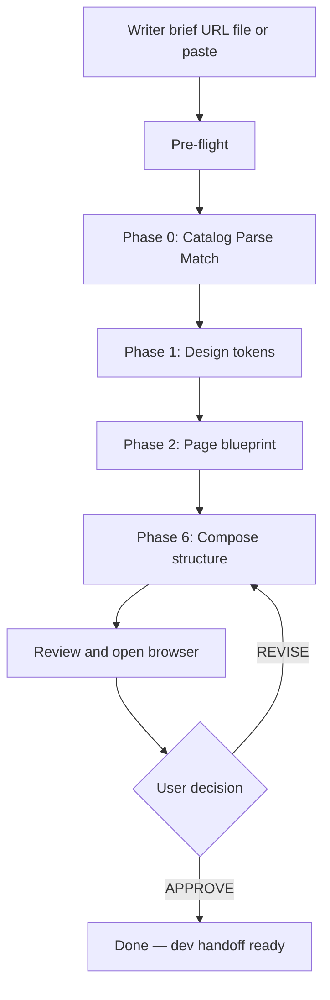

# Cursor Main Workflow — Writer Document Builds

**Quick-start for Cursor agents.** Coding law: [Rulesbook.md](Rulesbook.md) · Structure override: [.cursor/rules/structure-first-pipeline.mdc](../.cursor/rules/structure-first-pipeline.mdc)

This workflow turns a Zoho Writer brief into a **structured dev handoff** in `output/{page-slug}/`.

**Gold-standard example:** `output/sales-dashboard-examples/` — composed from section patterns (`banner-section`, `dashboard-wrapper` zigzag rows, `box-icon-section`, `steps-section`, `faq-section`), brief-driven block counts, placeholder assets.

**New Writer doc dropped?** Read **[writer-drop-playbook.md](writer-drop-playbook.md)** first — extraction, archetypes, section order, CTA visibility, pre-approve checks.

---

## Sources of truth

| Source | Role |
|--------|------|
| `cursor-build-workflow.md` | This playbook — phases, state, approval |
| `Rulesbook.md` | Permanent coding law — fonts, BEM, breakpoints |
| `.cursor/rules/structure-first-pipeline.mdc` | **Always-on override** — compose from section patterns, never clone whole pages |
| `section-index.json` | Section type → best reference folder + BEM class |
| `section-composites.json` | Multi-section archetypes (e.g. dashboard-examples landing) — **read when brief matches** |
| `writer-drop-playbook.md` | **New Writer drop** — exact output checklist, section order, reference patterns |
| Writer brief | **Only** source for copy, section list, and block counts |

**Two section-pattern sources (compose from either, per section):**

| Source | What | How to read |
|--------|------|-------------|
| `Reference-Site/{page}/` | Team pages on disk | Read local `index.html` / `style.css` / `script.js` |
| `webtemplate/sitemap-categorized.json` | 630 live Zoho links, 22 categories | **Fetch live page via Chrome MCP** (`new_page` + `evaluate_script`), extract one section only |



---

## 1. Pre-flight (every build)

Before any code:

1. Read `Rulesbook.md` in full
2. Read `source/zohocustom.css` and `source/product.css`
3. Load cached indexes (do **not** full-scan all folders):
   - `site-catalog.json` — reference site metadata
   - `section-index.json` — section type → best reference
   - `team-dna.json` — team tokens + synthesis threshold
   - `section-composites.json` — multi-section archetypes (dashboard-examples landing, etc.)
   - `writer-drop-playbook.md` — **read when a new Writer doc is dropped**
   - `agent-build-gates.md` — short pre-approve checklist
4. Read or initialize `state.json`

**Hard stops:** No build until the writer brief is loaded. Nav and footer are never built — comment placeholders only.

---

## 2. Acquire the Writer brief — Chrome MCP only

> **Full procedure:** [writer-drop-playbook.md](writer-drop-playbook.md) §1 (scroll all pages, login gate, save to `briefs/`).

**The only allowed method in this repo's test flow:**

| Step | Action |
|------|--------|
| 1 | `navigate_page` or `new_page` → `{writer-doc-link}` |
| 2 | **Login gate:** if URL/title is Zoho Accounts sign-in → **STOP**. Ask user to sign in in the MCP browser tab, then retry. Do not build. |
| 3 | `evaluate_script` → `WRITER_BROWSER_EXTRACT_FN` from `scripts/writer-extract-core.mjs` |
| 4 | Save → `briefs/{slug}.txt` (created in **this session** only) |
| 5 | `npm run validate:brief -- --file z_workflow/briefs/{slug}.txt` — must exit 0 |

**Forbidden — do not use:**

- Existing `briefs/*.txt` from a prior session (stale brief)
- Puppeteer `npm run extract:writer` as a substitute for MCP in the test flow
- Pasted text or pre-saved files when the user provided a Writer URL
- Proceeding to Phase 0+ when extraction failed or login wall is up

> **Trigger form:** `{writer-doc-link}` + `read readme.md and start` → open URL via Chrome MCP immediately. On login wall, stop and ask for sign-in — do not fall back to disk.

**Hard stop:** do not run `match-sites` or build until `validate:brief` exits 0 on a brief extracted **in this session** from the user's Writer URL.

Extract into `state.json → writer_brief`:

- `page_title`, `page_type`, `product_name`, `target_audience`, `tone`
- `keywords`, `key_messages`, `sections_required` (exclude nav/footer)
- Full raw copy saved to `briefs/{slug}.txt`

**The brief defines everything:** which sections exist, how many repeated blocks (dashboard types, FAQ items, cards), and all visible text.

---

## 3. Phase 0 — Catalog · Parse · Match

### 0-A Load catalog

Copy site metadata from `site-catalog.json` into `state.json → site_scan`. Print site count and readiness.

### 0-B Parse brief

Map writer content to section types: `hero`, `features`, `content-blocks`, `steps`, `faq`, `cta`, etc.

Count repeatable blocks (e.g. 8 dashboard types → 8 `dashboard-wrapper` zigzag rows).

### 0-C Similarity scoring

Run `node z_workflow/scripts/match-sites.mjs` using weights from `match-config.json`:

- Topic match (0–4)
- Page type match (0–2)
- Section structure overlap (0–2)
- Tone (0–1)
- Complexity (0–1)

**Deep-read only the sections you will use** — not every file in the top match. For each `sections_required` entry, read the mapped reference section's HTML + its CSS rules + any JS hook.

Build a **section source map** in `state.json → similarity.source_map`:

```
brief_section → reference folder → BEM class → layout style
```

Print match results and source map. Wait one cycle for user **OVERRIDE** or auto-proceed.

### Structure-first override (critical)

> **Do not clone whole reference pages.** Each build is a fresh composition from the writer's doc.
> Similarity matching picks section patterns and design flavour — not a page to copy wholesale.

Set `similarity.structure_mode: "compose"` in `state.json`.

Use `team-dna.json` + `section-index.json` alternates when a required section type is missing from the top 3 matches.

**Per-section source selection:** for each `sections_required` entry, choose ONE source and record it in the source map as `source_type: "reference" | "webtemplate"`:

- **`reference`** — the section pattern exists in a `Reference-Site/` folder (default; read from disk).
- **`webtemplate`** — no strong on-disk match, or the brief category maps to a live template category in `sitemap-categorized.json`. **Read `sections[]` descriptions** on each entry (order, type, class, layout) — pick the page that has the best-matching section for this brief item, not a whole page to clone. Fetch only that section live via Chrome MCP in Phase 6. Use `npm run find:webtemplate -- hero "split left"` to shortlist. Never pre-fetch all URLs here.

---

## 4. Phase 1 — Design tokens

Extract tokens from mapped reference sections + source files into `state.json → phase_1.design_tokens`:

- Colors as `--color-*` in `:root`
- Puvi via `var(--zf-primary-*)` — never numeric `font-weight`
- Spacing, radii, transitions from the reference sections used
- One-sentence `team_flavour` summary

---

## 5. Phase 2 — Page blueprint (no code yet)

Write `state.json → phase_2.webpage_blueprint` — a JSON spec per section:

- `source_site` — real folder name (e.g. `Executive-Dashboards`)
- `source_section_id` — reference class (e.g. `dashboard-wrapper`, `faq-section`)
- `repeat_count` — how many times to instantiate (from brief, not reference)
- `layout_style`, `bg_treatment`
- All copy from the brief (zero lorem ipsum)
- `adaptation_notes`: same BEM pattern, brief-driven content and counts

---

## 6. Phase 6 — Production build (structure-first)

Output: `output/{page-slug}/` with exactly three files: `index.html`, `style.css`, `script.js`.

### Mandatory build order

1. **Compose `index.html`** — one section at a time from blueprint:
   - Pull HTML skeleton from the mapped source:
     - `source_type: reference` → read the section from the `Reference-Site/` folder on disk.
     - `source_type: webtemplate` → `new_page {url, background:true}` for that section's template link, then `evaluate_script` to return **only that section's `outerHTML` + relevant computed styles**. Reuse its DOM shape + BEM classes; do not inline the site's full CSS/JS.
   - Repeat blocks per `repeat_count`
   - Inject all copy from `briefs/{slug}.txt`
2. **Write `style.css`** — only rules for classes on this page:
   - Global typography block at top
   - `:root` from Phase 1 tokens
   - Section CSS extracted from reference (not full-file copy)
   - All 7 breakpoints at bottom
3. **Write `script.js`** — only behaviors present (accordion, slick, tabs, sticky scroll, etc.)
4. **Link** `../../source/zohocustom.css` and `../../source/product.css`
5. **Images** — universal placeholder `https://prezohoweb.zoho.com/` + `<!-- TODO: replace with final asset -->` (see `Rulesbook.md` §2.8)
6. **Nav/footer** — placeholders only:

```html
<!-- ░░ NAV — TEAM TEMPLATE · INSERT HERE ░░ -->
<!-- ░░ FOOTER — TEAM TEMPLATE · INSERT HERE ░░ -->
```

### Adaptation rule

| Keep from reference pattern | Driven by brief |
|----------------------------|-----------------|
| BEM class names and DOM hierarchy | Which sections exist |
| Component shape (card, zigzag row, accordion) | How many repeated blocks |
| Spacing, breakpoints, animation hooks | All visible text |
| JS interaction patterns | Images, hrefs, section ids |

### Dev handoff

The agent delivers **structure**, not a finished production page. Devs:

- Insert nav/footer from team templates
- Replace `https://prezohoweb.zoho.com/` placeholder URLs with final assets
- Polish spacing or one-off design tweaks as needed

### Section gate (per section)

- BEM classes match mapped reference pattern
- Copy only from brief — no invented headings or sections
- Block count matches brief (not reference page)
- Mid-page/closing red CTAs inside `pre-banner-section` with textured background (not plain white band)
- Breakpoints: **1240 · 1080 · 991 · 767 · 565 · 480 · 350**

---

## 7. Review, revise, approve

After all three files are written:

1. Run `npm run validate:output -- --slug {page-slug}` (or `--from-state`) — must exit 0
2. Run `/review` or checklist in `.cursor/rules/web-pages-frontend.mdc`
2. **Auto-open the output in the browser (mandatory, every build)** via Chrome MCP:
   `new_page { url: "file:///<abs-repo-path>/output/{slug}/index.html" }`
   (or `navigate_page {type:"url", url:"file://…"}` in the current tab). Then `take_snapshot` /
   `take_screenshot` for the summary. Confirm CTAs render (see `writer-drop-playbook.md` §4/§6).
3. Print build summary (section mapping, per-section source_type, synthesised sections if any)
4. Wait for user:

| Command | Action |
|---------|--------|
| **APPROVE** | Set `state.json → phase_6.approved = true` |
| **REVISE: [issue]** | Fix only named issue, re-write affected file only, increment `phase_6.revise_rounds` |
| **PROMOTE** | Run `npm run promote -- --from-state` **after dev polish** → `agent-reference/` + SITE_AUDIT |

After **APPROVE**, devs polish `output/{slug}/` (nav, footer, assets). Then promote — **not** at APPROVE time:

```bash
npm run promote -- --from-state
```

Promote copies to `Reference-Site/agent-reference/`, fixes CSS paths, and refreshes `site-catalog.json`.

---

## 8. State tracking

Every phase reads/writes `state.json`:

```json
{
  "run_id": "sales-dashboard-examples-2026-06-29",
  "writer_brief": { "...": "..." },
  "similarity": {
    "primary_source": "Executive-Dashboards",
    "structure_mode": "compose",
    "source_map": ["..."]
  },
  "phase_6": {
    "output_path": "output/sales-dashboard-examples/",
    "approved": false,
    "promoted": false,
    "reference_folder": "",
    "revise_rounds": 0
  }
}
```

---

## 9. Maintenance commands

Run **`npm run commands`** for the full cheat sheet. See `z_workflow/MAINTENANCE.md`.

| Command | When |
|---------|------|
| `npm run commands` | Print all maintenance commands |
| `npm run audit` / `SITE_AUDIT` | New reference site added, after promote, major revamp, or stale catalog |
| `npm run match -- --brief "..."` | Validate scoring against a brief |
| `npm run match:validate` | Run validation set (≥90% accuracy) |
| `npm run promote -- --from-state` | After APPROVE — copy output to reference library + audit |
| `npm run promote -- --slug <slug>` | Promote a specific output folder |
| `node z_workflow/scripts/site-audit.mjs` | Same as `npm run audit` |
| `node z_workflow/scripts/match-sites.mjs` | Same as `npm run match` |
| `npm run organize` | Move stray root reference folders → `Reference-Site/` |

---

## 10. Reference example — sales-dashboard-examples

**Composed from:** `Executive-Dashboards` section patterns (not a full-page clone)  
**Output:** `output/sales-dashboard-examples/`

What correct structure-first output looks like:

- `banner-section` hero — split text + image
- `dashboard-wrapper` — 8 zigzag blocks (brief count), not reference page count
- `pre-banner-section` — CTA bands (×2 as brief requires)
- `box-icon-section` — 6 CRM cards from brief
- `steps-section` — 4 tabbed steps from brief
- `faq-section` — 5 accordion items from brief
- CSS contains only rules for classes on this page
- JS trimmed to page behaviors only
- Nav/footer = comment placeholders

---

## Anti-patterns (do not do these)

- Copying entire reference `style.css` or `script.js`
- Cloning a whole reference `index.html` and swapping copy
- Using `output/*` pages as clone templates
- Keeping reference sections not in the writer's doc
- Inventing section class names when `section-index.json` has a pattern
- Building nav or footer code
- Copying `zohocustom.css` or `product.css` into the page folder

---

*Cursor quick-start · Structure-first enforced via .cursor/rules/structure-first-pipeline.mdc*
